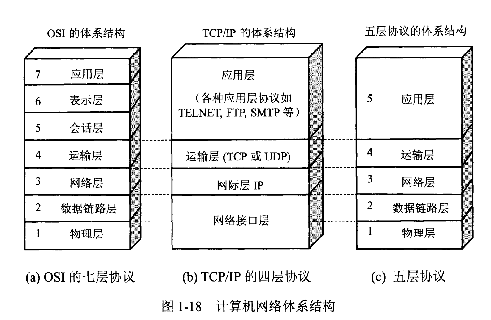

#### TCP/UDP

运输层：提供的是进程间的通用数据传输服务。由于应用层协议很多，定义通用的运输层协议就可以支持不断增多的应用层协议。运输层包括两种协议：传输控制协议 TCP，提供面向连接、可靠的数据传输服务，数据单位为报文段；用户数据报协议 UDP，提供无连接、尽最大努力的数据传输服务，数据单位为用户数据报。TCP 主要提供完整性服务，UDP 主要提供及时性服务。

### tcp/udp 特点

用户数据报协议 UDP（User Datagram Protocol）是无连接的，尽最大可能交付，没有拥塞控制，面向报文（对于应用程序传下来的报文不合并也不拆分，只是添加 UDP 首部）

传输控制协议 TCP（Transmission Control Protocol）是面向连接的，提供可靠交付，有流量控制，拥塞控制，提供全双工通信，面向字节流（把应用层传下来的报文看成字节流，把字节流组织成大小不等的数据块）。

### tcp三次握手

假设 A 为客户端，B 为服务器端。

1. 首先 B 处于 LISTEN（监听）状态，等待客户的连接请求。
2. A 向 B 发送连接请求报文段，SYN=1，ACK=0，选择一个初始的序号 x。
3. B 收到连接请求报文段，如果同意建立连接，则向 A 发送连接确认报文段，SYN=1，ACK=1，确认号为 x+1，同时也选择一个初始的序号 y。
4. A 收到 B 的连接确认报文段后，还要向 B 发出确认，确认号为 y+1，序号为 x+1。
5. B 收到 A 的确认后，连接建立。

三次握手的原因

为了防止失效的连接请求到达服务器，让服务器错误打开连接。

1. A 发送连接释放报文段，FIN=1；
2. B 收到之后发出确认，此时 TCP 属于半关闭状态，B 能向 A 发送数据但是 A 不能向 B 发送数据；
3. 当 B 要不再需要连接时，发送连接释放请求报文段，FIN=1
4. A 收到后发出确认，进入 TIME-WAIT 状态，等待 2MSL 时间后释放连接。
5. B 收到 A 的确认后释放连接

四次挥手的原因

客户端发送了 FIN 连接释放报文之后，服务器收到了这个报文，就进入了 CLOSE-WAIT 状态。这个状态是为了让服务器端发送还未传送完毕的数据，传送完毕之后，服务器会发送 FIN 连接释放报文。
